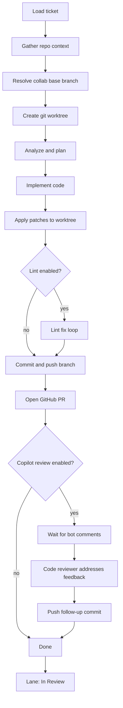

# ai-web-team

A multi-agent AI system for two workflows:

1. **Greenfield** — turn a plain-English brief into a scaffolded web app (PM → Designer → Architect → Developer).
2. **Jira mode** — run a senior coding agent per ticket against a real repo: plan, implement, lint, open PRs, and track work on a swim board.

Watch agents work in real time via the **web UI** (primary) or the **Expo mobile app**.


Repo: [github.com/loudowl/ai-web-team](https://github.com/loudowl/ai-web-team)

---

## Modes

<h3 style="color: #3fb950;">Greenfield (4-agent pipeline)</h3>

| Agent | Role | Output |
|---|---|---|
| 📋 **Project Manager** | Brief → structured PRD | Requirements, user stories, priorities |
| 🎨 **Designer** | PRD → design brief | Palette, typography, layouts |
| 🏗️ **Architect** | PRD + design → architecture | Stack, folders, API contracts |
| 💻 **Developer** | All above → code | Runnable implementation |

Each agent receives prior agents' output as context. When finished, push to a new GitHub repo from the UI.

<h3 style="color: #3fb950;">Jira mode (ticket swim board)</h3>

Each ticket is processed inside an isolated git worktree. Runs are launched **one ticket at a time** from the swim board (or in bulk via the legacy batch pipeline). Progress streams over WebSocket to the web UI.

| Agent | Role | Output |
|---|---|---|
| 🧑‍💻 **Senior Full-Stack Developer** | **Plan** — Jira ticket + repo context → approach | Understanding, `- [ ]` task list, target file paths |
| 🧑‍💻 **Senior Full-Stack Developer** | **Implement** — approved plan → code | Full-file `### path/to/file` blocks written to the worktree |
| 🧑‍💻 **Senior Full-Stack Developer** | **Lint** — eslint failures → clean code | Auto-fix + agent patch loop until lint passes |
| 🧑‍💻 **Senior Full-Stack Developer** | **Ship** — worktree → GitHub | Commit on `codex/{TICKET-KEY}`, PR against collab release branch |
| 🔍 **Code Reviewer** | **Review** — Copilot / bot PR comments → fixes | Follow-up patches and push (Simple fix & Full cycle only) |

The senior dev works **one ticket at a time**, ignores unrelated repo templates, and validates that the plan references the ticket key and topic before implementing.

**Board lanes:** To Do → In Progress → In Review → Dev Complete (drag to Dev Complete when merged)

**Workflows per ticket** (chosen when you click a card action):

| Workflow | Lint | Copilot review | Notes |
|---|---|---|---|
| **Simple fix** | ✓ | ✓ | Default; lint + PR + address bot review if comments appear |
| **Fix** | ✓ | — | Scoped fix; skips Copilot review pass |
| **Full cycle** | ✓ | ✓ (120s wait) | Extended wait for Copilot feedback before review agent runs |

See **[Jira pipeline](#jira-pipeline)** below for the full step-by-step flow.

---

## Jira pipeline

End-to-end flow for a single ticket run (`backend/agents/jira_runner.py`).

### How a run starts

1. Create a **Jira batch** (project with `mode=jira`) and add tickets by key, URL, or manual text.
2. On the swim board, click **Simple fix**, **Fix**, or **Full cycle** on a To Do card.
3. The API validates the configured model (for Ollama, prompts to download if missing), then schedules an async job.
4. The ticket moves to **In Progress**; milestones and streamed output appear in the ticket modal and activity feed.

Concurrency is capped by `JIRA_MAX_PARALLEL` (default `1` for local Ollama).

### Pipeline overview



### Milestones

Each step emits a WebSocket `milestone` event shown in the UI:

| Step | ID | What happens |
|---|---|---|
| Load ticket | `fetch_ticket` | Refresh title, description, AC, and fix versions from Jira API when configured |
| Gather repo context | `gather_context` | Resolve collab branch; build repo snapshot for prompts |
| Create worktree | `create_worktree` | `git worktree` from collab base into `data/worktrees/…` |
| Analyze & plan | `analyze_plan` | Senior dev plans fix; validates plan references ticket key/topic |
| Implement | `implement` | Senior dev emits `### path/to/file` code blocks; retries if none found |
| Apply code changes | `apply_patches` | Parse fences and write files into the worktree |
| Fix lint errors | `fix_lint` | `eslint --fix`, then agent loop until clean or `JIRA_LINT_MAX_ROUNDS` |
| Commit & push | `commit_push` | Commit on `codex/{TICKET-KEY}` branch (prefix configurable) and push |
| Create pull request | `create_pr` | Open PR against collab base via GitHub API; lane → **In Review** |
| Address Copilot review | `address_review` | Wait for bot comments; code_reviewer applies critical fixes and pushes |

On success the ticket status is `done` and `pr_url` is stored. On failure the ticket status is `error` and output preserves any partial plan/implementation plus the error message.

### Collab branch resolution

Jira **fix versions** determine the git base branch for worktrees and PR targets:

1. Parse version from fixVersion name (e.g. `FTS Web 11.5.0` → `11.5.0`).
2. Map to `{JIRA_COLLAB_BRANCH_PREFIX}{version}` (default `collab/release-11.5.0`).
3. `git fetch origin` and use the branch if it exists on the remote.
4. If no fix version on the ticket, fall back to `GITHUB_BASE_BRANCH` or the repo’s default branch.

Configure prefix via `JIRA_COLLAB_BRANCH_PREFIX` (see `backend/utils/collab_branch.py`).

### Feature branch naming

Ticket branches use `JIRA_BRANCH_PREFIX` + ticket key (default `codex/FTSWB-1234`). Optional `JIRA_BRANCH_SUFFIX` for team conventions.

### Lint loop

When lint is enabled for the workflow (or globally via `JIRA_LINT_ENABLED`):

1. Run `JIRA_LINT_FIX_COMMAND` (default `npm run lint:fix`) on changed files.
2. Run `JIRA_LINT_COMMAND` (default `npm run lint`).
3. If lint fails, prompt the agent with lint output; apply new patches; repeat up to `JIRA_LINT_MAX_ROUNDS`.
4. Fail the run if lint still fails after all rounds.

Lint commands run in the worktree; paths can be resolved relative to `REPO_CONTEXT_PATH` when the repo is nested.

### Copilot / bot review pass

When enabled and `GITHUB_TOKEN` is set:

1. Poll the PR for review comments (`JIRA_COPILOT_WAIT_SEC`; **Full cycle** uses 120s).
2. Filter bot reviewers (Copilot, etc.).
3. **code_reviewer** agent decides if critical fixes are needed.
4. If patches are produced, re-run lint (if enabled), commit, and push to the same branch.

If there are no bot comments yet, the step completes with “No Copilot comments yet” and the PR remains open for human review.

### Board lane transitions

| Event | Lane |
|---|---|
| Run started | `in_progress` |
| PR opened | `in_review` |
| Manual drag (UI) | `dev_complete` |
| Archive action | removed from board (`archived`) |

Live run state also considers `pr_url` and streaming status when resolving lanes on reconnect.

### WebSocket events (Jira)

Key event types on `/ws/{projectId}`:

| Type | Purpose |
|---|---|
| `ticket_start` / `ticket_done` | Run lifecycle |
| `milestone` | Pipeline step progress |
| `token` | Streamed model output |
| `thinking` | Heartbeat / phase message |
| `tasks` | Parsed `- [ ]` task list from plan |
| `board_lane` | Lane change |
| `pr_created` | PR URL available |
| `error` | Run failed |

On connect, `replay_board_state` re-sends lanes, saved output, and PR URLs for active tickets.

### Prerequisites

| Requirement | Used for |
|---|---|
| `REPO_CONTEXT_PATH` | Target repo (single repo path, not a parent folder) |
| `GITHUB_TOKEN` | Push branch, open PR, read review comments |
| Jira API creds (optional) | Live ticket refresh; paste/key still works without API |
| Ollama / OpenAI / Anthropic | Senior dev + code reviewer LLM calls |
| Pulled Ollama model | Local runs; UI can prompt to download missing models |

**Tip:** Set `RELOAD=false` in `.env` during long runs so uvicorn doesn’t restart when worktree files change.

---

## Web UI

The web app (`web/`) is the main interface:

- **Dashboard** — stats, Jira batches, greenfield sessions, quick actions
- **Global nav** — Home · New Jira project · Jira board · Settings
- **Jira board** (`/board`) — all non-archived tickets across batches in one swim board
- **Per-batch board** (`/board/:projectId`) — tickets for one batch
- **Ollama memory meter** — RAM budget as tickets move to In Progress
- **Model pull modal** — if an assigned Ollama model is missing, download it in-app with progress, then auto-start the run
- **Demo mode** — sample swim board without backend

Floating **+** on the dashboard opens a new greenfield project. **Jira ticket** / **Greenfield** buttons launch the corresponding new-project flows.

---

## Mobile UI

The Expo app (`mobile/`) provides:

- **Kanban board** — four greenfield agents with live status
- **Activity feed** — streaming tokens and events
- **Settings** — Ollama model list, pull progress, delete

Use your machine's LAN IP in `EXPO_PUBLIC_API_URL` when testing on a physical device.

---

## Setup

### Backend

```bash
cd backend
python -m venv .venv && source .venv/bin/activate
pip install -r requirements.txt
cp .env.example .env   # fill in keys + Jira/repo paths for Jira mode
python main.py
```

API default: `http://localhost:3001`

### Web

```bash
cd web
npm install
npm run dev
```

UI default: `http://localhost:5173`

Optional `web/.env`:

```
VITE_API_URL=http://localhost:3001
```

### Mobile

```bash
cd mobile
npm install
cp .env.example .env
npx expo start
```

---

## Configuration

### Backend `.env` (highlights)

| Variable | Description |
|---|---|
| `OPENAI_API_KEY` / `OPENAI_MODEL` | OpenAI via Responses API |
| `ANTHROPIC_API_KEY` / `ANTHROPIC_MODEL` | Claude |
| `OLLAMA_BASE_URL` / `OLLAMA_MODEL` | Local Ollama (default port 11434) |
| `DEFAULT_PROVIDER` | `openai` · `anthropic` · `ollama` |
| `GITHUB_TOKEN` / `GITHUB_USERNAME` | Push greenfield projects + Jira PRs |
| `JIRA_BASE_URL` / `JIRA_EMAIL` / `JIRA_API_TOKEN` | Jira API (optional; paste works too) |
| `REPO_CONTEXT_PATH` | Path to target repo for Jira worktrees |
| `JIRA_COLLAB_BRANCH_PREFIX` | e.g. `collab/release` → `collab/release-11.5.0` |
| `SENIOR_DEV_MODEL` | Override coding model for Jira runs |
| `JIRA_MAX_PARALLEL` | Concurrent ticket runs (default 1 for Ollama) |
| `OLLAMA_NUM_CTX` / `OLLAMA_KEEP_ALIVE` | Tune local RAM / unload behavior |
| `RELOAD` | Set `false` during long Jira runs to avoid uvicorn reload |

See `backend/.env.example` for lint, Copilot review, and per-agent overrides.

At least one LLM provider must be configured. For Jira mode with Ollama, pull a coding model first (e.g. `ollama pull codestral`) or use the in-app download prompt.

### Mobile `.env`

```
EXPO_PUBLIC_API_URL=http://YOUR_MACHINE_IP:3001
```

---

## Model manager

From **Settings** (web or mobile):

- List installed Ollama models and sizes
- Pull models with live progress (SSE)
- Delete models
- Memory meter (web board) estimates concurrent ticket RAM

Recommended local coding models: **codestral**, **devstral**, **qwen2.5-coder**, **deepseek-coder-v2**.

---

## Architecture

```
ai-web-team/
├── backend/
│   ├── main.py
│   ├── config.py
│   ├── database.py              SQLite: projects, tickets, agent runs
│   ├── agents/
│   │   ├── runner.py            Greenfield pipeline
│   │   ├── jira_runner.py       Per-ticket Jira agent + board replay
│   │   └── prompts.py
│   ├── models/
│   │   ├── providers.py         OpenAI / Anthropic / Ollama streaming
│   │   ├── model_catalog.py     Curated model picker metadata
│   │   └── coding_agents.py
│   ├── routes/
│   │   ├── projects.py
│   │   ├── board.py             Per-project board API (run, archive, lanes)
│   │   ├── board_global.py      All-tickets board API
│   │   ├── models.py            Ollama pull / check / memory
│   │   └── ws.py                WebSocket events
│   └── utils/
│       ├── git_worktree.py
│       ├── github_pr.py
│       ├── jira_client.py
│       ├── collab_branch.py
│       ├── lint_runner.py
│       └── repo_context.py
├── web/                         Vite + React dashboard & swim board
└── mobile/                      Expo client
```

---

## Stack

- **Backend:** Python 3.11+ · FastAPI · WebSockets · SQLite
- **Web:** React 18 · Vite · React Router · Zustand · Lucide
- **Mobile:** React Native · Expo · Zustand
- **LLMs:** OpenAI · Anthropic · Ollama
- **Git:** worktrees, GitHub PR API, optional Contents API push (greenfield)
